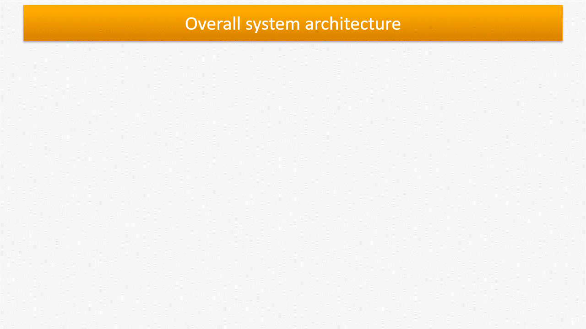
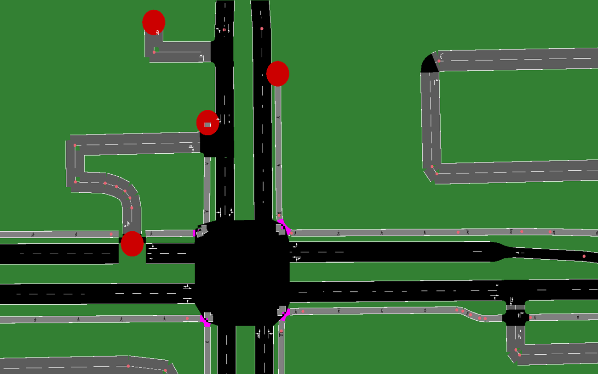

# 高级自适应交通信号灯控制系统

本仓库存放高级自适应交通信号灯控制系统，该系统结合机器学习与微控制器技术，对交通信号灯实现更高效的自适应管控。本系统专为处理复杂交通场景设计，可依据实时路况动态调整每个信号灯相位的持续时长。

## 概述

该系统利用机器学习模型与 ESP 系列微控制器对路口交通信号灯进行管控。本版本主要特性包括：可处理包含多车道的复杂地图，并根据当前交通状况动态计算各信号灯相位的持续时间。通信网络新增蓝牙功能，保障通信稳定且连接方式灵活。

## GIF 演示动图



## 复杂路口示例

新版模型能够处理车道结构错综复杂的复杂路口。下图为该系统可管控的一类复杂路口示例：



## 主要功能

1. **复杂地图处理**：该模型可管控多车道路口，适用于结构更加复杂的交通路网。
2. **动态相位时长**：系统根据车辆数量计算各信号灯相位的持续时间，针对实时交通状况做出自适应响应。
3. **蓝牙集成**：通信网络加入蓝牙，提升各组件之间的连接能力。

## 系统组成

- **ESP 微控制器**：管控交通信号灯，并与中央控制系统通信。
- **机器学习模型**：分析实时交通数据，输出最优信号灯配时方案。
- **通信网络**：使用蓝牙实现微控制器与中央系统之间稳定、灵活的数据连接。

## 安装与部署

### 环境依赖

- SUMO（城市交通仿真工具），用于交通仿真。
- Python 3.8 及所需依赖库（依赖项详见 `requirements.txt`）。
- 具备蓝牙功能的 ESP 系列微控制器。
- 适配通信网络的硬件环境。

### 安装步骤

1. **克隆代码仓库**：

```
git clone https://github.com/AhmedMohamedomar74/adaptive-traffic-light-control-system.git
cd adaptive-traffic-light-control-system/V2
```

2. **安装依赖库**：

```
pip install -r requirements.txt
```

3. **SUMO 图形仿真工具**：
如尚未安装，请访问 https://sumo.dlr.de/docs/Downloads.php 下载并安装 SUMO GUI。

### 硬件配置

1. **微控制器配置**：
使用项目提供的代码对 ESP 微控制器进行配置，确保蓝牙功能正常。
2. **网络配置**：
通过蓝牙搭建微控制器与中央系统之间的通信网络。

### 运行系统

1. **上电启动微控制器**：
确认所有微控制器接线正常并已通电。
2. **运行控制脚本**：
通过蓝牙搭建微控制器与中央系统之间的通信网络

```
python train.py
```

3. **运行高级版模型**：
执行以下命令运行高级模型：

```
python train_adv.py
```

此外，需要修改配置文件：

- 在配置文件中将 `city1` 修改为 `osm`，以适配高级模型的运行要求。


